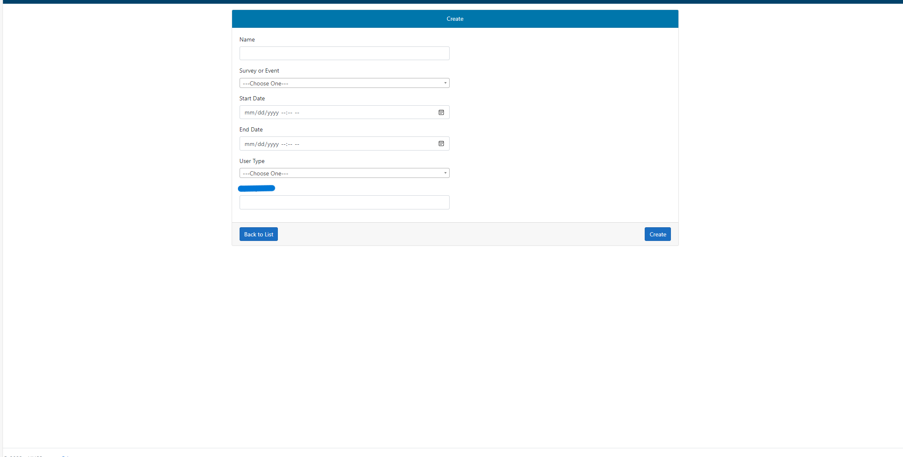
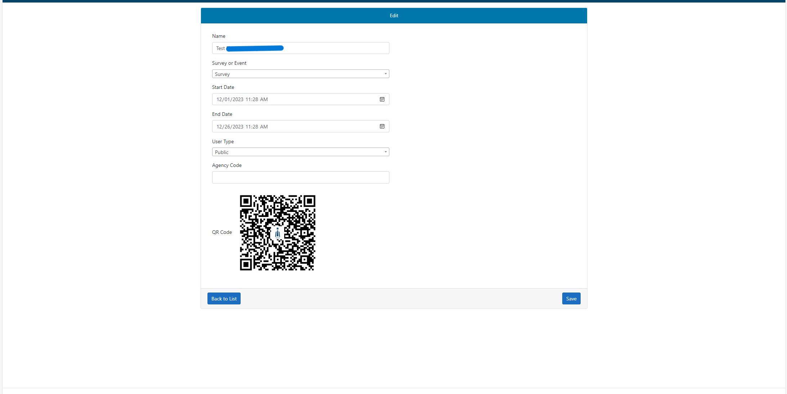
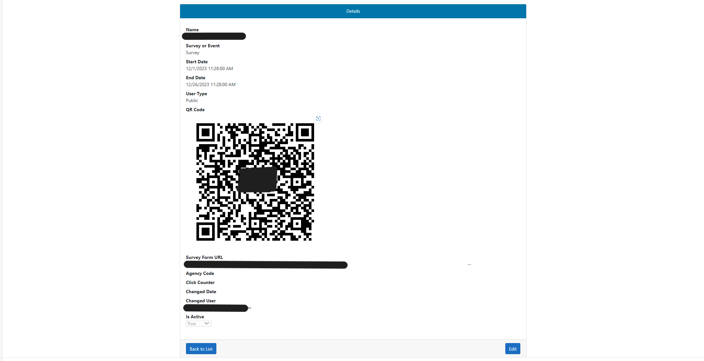

# .NET-Survey-Management-System

**Overview**

The Survey Web Application is a versatile platform developed in C# to simplify the process of creating, managing, and conducting surveys or events. The application features a QR code generator, allowing users to easily share survey links, a user-friendly dashboard for employees, and public-facing survey pages for participants.

**Features**
- **QR Code Generator**:
Create QR codes for survey or event links.
Dynamic QR codes that can be updated with new survey links.
- **Survey and Event Page Creation**:
Intuitive interface to create and customize survey or event pages.
Add questions, options, and customize the look and feel.
- **Public-Facing Surveys**:
Generate unique URLs for public access to surveys.
Participants can easily access and complete surveys using these URLs.
- **Employee Dashboard**:
Secure login for employees.
Dashboard displaying survey responses, analytics, and management tools.

**Usage**

- **QR Code Generation**:
Navigate to the QR Code Generator section.
Enter the survey or event link.
Click "Create " to get the QR code image.

- **Survey and Event Creation**:
Go to the Survey or Event Page Creation section.
Follow the step-by-step process to create a new survey or event page.
Customize the appearance and add questions.

- **Public-Facing Surveys**: Survey/Event generation creates a url.

- **Third Party Surveys**: linked from database

- **Employee Dashboard**:
Log in with your employee credentials.
Access the dashboard to view survey responses, analytics, and manage surveys.

**Technologies Used**
- **C#**: The primary programming language used for backend development.
- **.NET 6**: Framework for building web applications.
- **Entity Framework Core**: Object-Relational Mapping (ORM) for database interactions.
- **Microsoft SQL Server Management Studio **: Database Management.
- **HTML, CSS, JavaScript**: Frontend technologies for creating interactive user interfaces.
- **Bootstrap**: Frontend framework for responsive UI.

# Screengrabs

