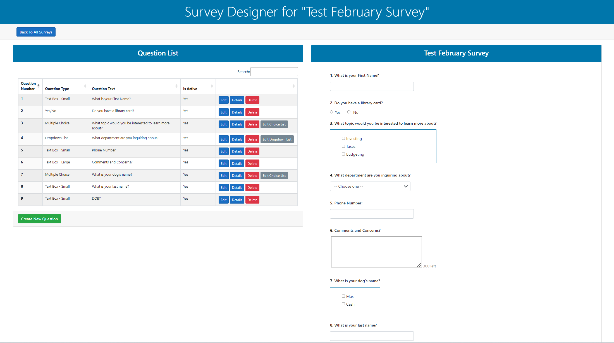
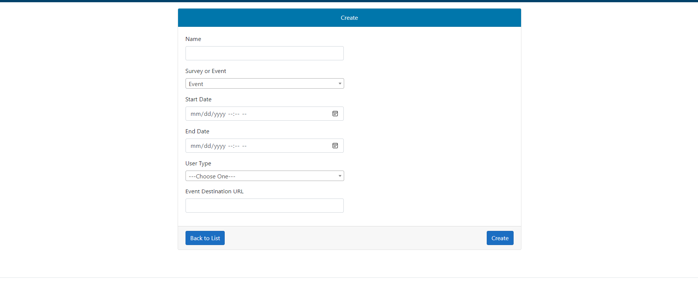
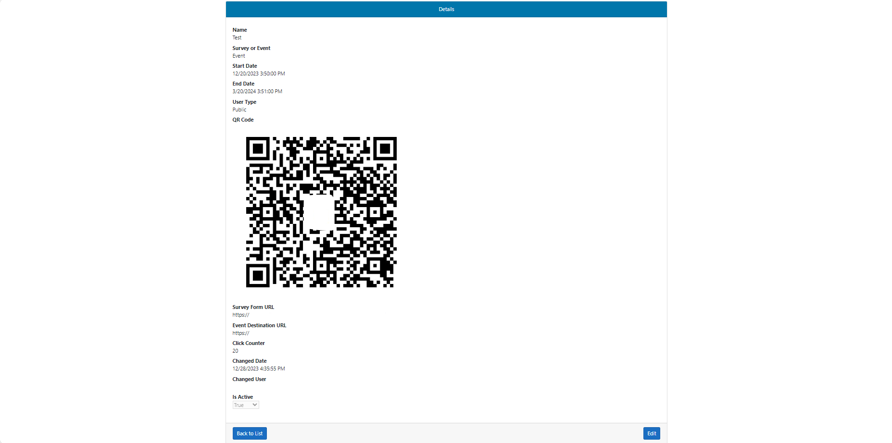
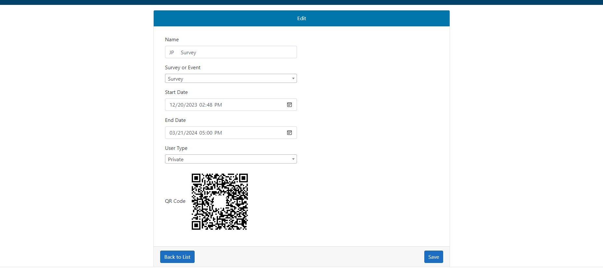
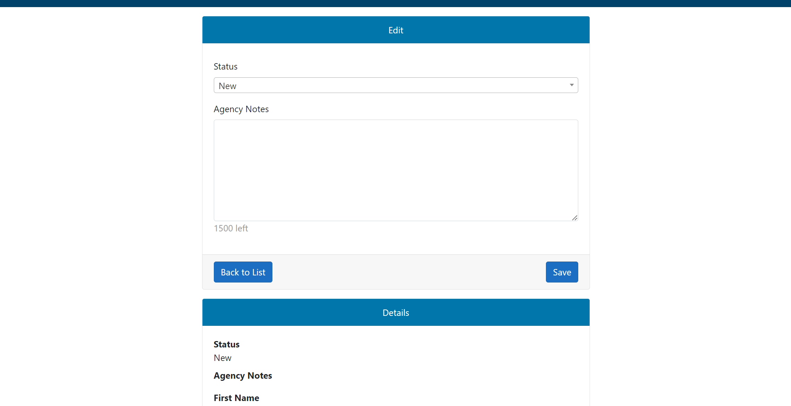
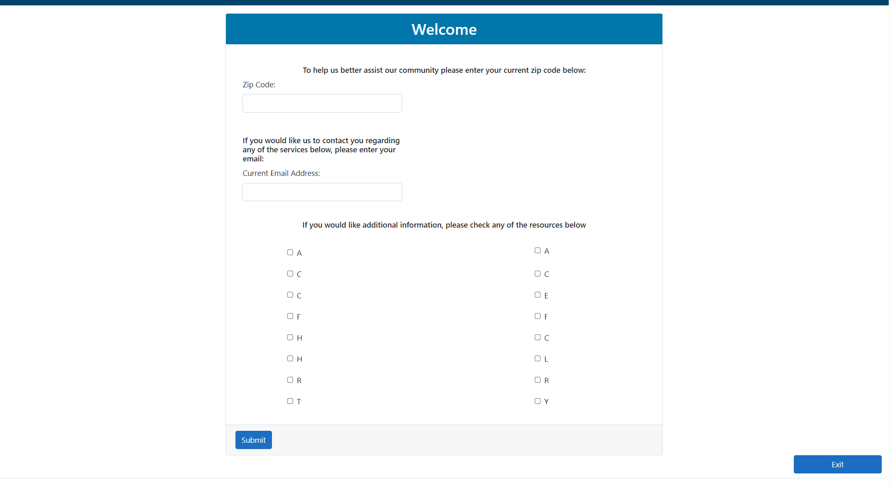
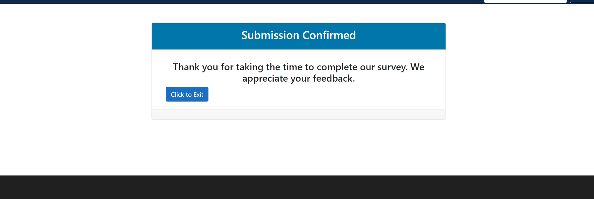
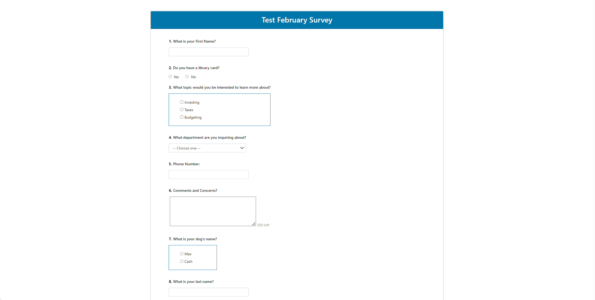

# .NET-Content Survey-Management-System

**Overview**
This Survey Web Application is a versatile platform developed in C# to simplify the process of creating, managing, and conducting surveys or events. The application features a QR code generator, allowing administrators and supervisors to easily share survey links, a user-friendly dashboard for employees, and public-facing survey and splash pages for participants.

**Features**
- **QR Code Generator**:
Create QR codes for survey or event links.
Dynamic QR codes that can be updated with new survey links.
- **Survey and Event Page Creation**:
For administration and supervisor use. Intuitive interface to create and customize survey or events.
Add questions, options, and customize the look and feel.
- **Public-Facing or Private Surveys**:
The application generate unique URLs for public access to surveys if they are marked as public by admin. If private they will require users to register to an account to participate in survey. 
Participants can easily access and complete surveys using these URLs.
- **Public-Facing Events**:
The application will route the QR code to the destination URL set by administration at event creation. This will route the user to the public events splash page, and then to destination url.
- **Employee Dashboard**:
Secure login for employees.
Dashboard displaying survey responses, analytics, and management tools.

**More UI Technical Features**
- **Responsive forms using JavaScript**:
- - **Storing and showing images within database and databales & CRUD Pages**:
- **Routing manipulation**
- **URL Creation**

**Usage**

- **QR Code Generation**:
Admin will navigate to the QR Code Generator create page.
Enter the information required, (input validation)
Click "Create " to get the QR code image.

- **Survey and Event Creation**:
Go to the Survey or Event Page Creation section.
Follow the step-by-step process to create a new survey or event page.
Customize the appearance and add questions.

- **Public-Facing Surveys**: Survey/Event generation creates a url.

- **Third Party Surveys**: linked from database

- **Employee Dashboard**:
Log in with your employee credentials.
Access the dashboard to view survey responses, analytics, and manage surveys.

**Technologies Used**
- **C#**: The primary programming language used for backend development.
- **.NET 6**: Framework for building web applications.
- **Entity Framework Core**: Object-Relational Mapping (ORM) for database interactions.
- **Microsoft SQL Server Management Studio **: Database Management.
- **HTML, CSS, JavaScript**: Frontend technologies for creating interactive user interfaces.
- **Bootstrap**: Frontend framework for responsive UI.

# Screengrabs

# Employee Dashboard - Work Page

# Dynamic Survey Designer

